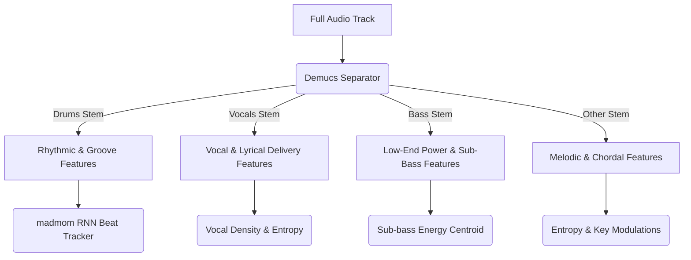

# PLAN: Deep Audio Analysis (Phase C — Advanced Tempo, Stem-Isolated Features, & Semantic UMAP Projections)

This plan outlines the design to replace standard mixed-audio analysis with **stem-separated feature extraction** and **targeted UMAP projections** using **Demucs** and **`madmom`** under Apple Silicon GPU (MPS) hardware acceleration.

---

## 1. Enabling Apple Silicon GPU (MPS) Acceleration

PyTorch supports Metal Performance Shaders (MPS) natively on Apple Silicon (M1/M2/M3/M4) Macs. Demucs uses PyTorch and can be directed to utilize MPS, dropping track-stemming time from **~25 seconds to under ~5 seconds** per track.

### A. Verification Script
Before executing the pipeline, we run this Python check:
```python
import torch

if torch.backends.mps.is_available():
    print("MPS is available! Apple Silicon GPU acceleration enabled.")
    device = torch.device("mps")
else:
    print("MPS NOT available. Falling back to CPU.")
    device = torch.device("cpu")
```

### B. Running Demucs on GPU
We run the separation command by passing the device parameter:
```bash
demucs --device mps -n htdemucs -o ./.temp_stems track.mp3
```

---

## 2. Stem-Isolated Multi-Feature Extraction

Running analysis on mixed tracks dilutes details (e.g. drums wash out chroma pitches, vocals confuse drum envelope onset detectors). Stem separation allows us to extract pristine, isolated variables:



### A. Drums Stem Features (Rhythm & Tempo)
* **Pristine Tempo**: Run the `madmom` RNN beat tracker only on the drums stem. Completely eliminates double/half octave errors triggered by vocals or arpeggios.
* **Syncopation Index**: Measures the irregularity and off-beat density of drum hits.
* **Transient Energy**: Measures the physical punch and transients in the drumming.

### B. Vocals Stem Features (Lyrical Delivery)
* **Vocal Density**: The percentage of the track where vocals are actively present (separating purely instrumental tracks, vocal-intro tracks, and vocal-dense tracks).
* **Vocal Style Entropy**: Evaluates spectral variance of vocals to classify delivery style (e.g. spoken/rap vs. sustained singing).

### C. Bass Stem Features (Low-End Power)
* **Sub-Bass Ratio**: Ratio of sub-bass (<60 Hz) to mid-bass (60–250 Hz) energy.
* **Bass Centroid**: Identifies if the low-end is a static ambient drone or a dynamic bassline.

### D. Other Stem Features (Synthesizers, Guitars, Keyboards)
* **Harmonic Complexity**: Entropic chroma analysis on the melodic stem only, ensuring drum noise does not pollute key modulations.

---

## 3. Advanced Granular Representations (Corpus Context)

Given that the corpus spans a wide range from **ambient to metal**, with significant clustering tendencies around **folktronica** and **math/post-math**, we implement four specialized data representations to capture this texture:

### A. Written Style Prompt UMAP (Creator Intent Space)
* **Design**: Vectorize the raw Suno text style prompts (e.g., `math-rock acoustic folktronica male vocals`) using a dense text encoder (like sentence-transformers `all-MiniLM-L6-v2` or the CLAP text encoder).
* **Projection**: Project these text embeddings into 2D using UMAP.
* **Why**: This maps the **creator's semantic intent**. It groups tracks purely by how they were described, cleanly separating written genre tokens (folk, metal, math, ambient) and exposing the language patterns guiding the generation.

### B. The "Math Index" (Rhythmic Irregularity)
* **Design**: Math-rock and post-math tracks are defined by syncopated, off-beat drumming, micro-timing shifts, and time-signature modulations.
* **Metric**: Combine **drum stem syncopation** (measured by the deviation of onset intervals from a strict grid) and **tempo drift**.
* **Formula**: `MathIndex = w1 * Syncopation + w2 * TempoDrift`. High values isolate complex post-math math-rock drum grids, while low values isolate steady house beats or ambient drones.

### C. Continuous Vocal Presence Spectrum
* **Design**: Generative tracks range from pure instrumentals to ambient chopped vocal chops, to fully lyrical singing/rap.
* **Metric**: Calculate the RMS energy ratio of the isolated vocal stem against the total track mix over time.
* **Result**: Maps a continuous scale:
  * `0.0`: Pure Instrumental (ambient, drum & bass).
  * `0.1 - 0.4`: Ambient vocal textures/vocal chops (folktronica).
  * `0.5 - 1.0`: Lyrical lead vocals (singing, rap).

### D. Prompt-to-Acoustic Fidelity (AI Alignment Dissonance)
* **Design**: Calculate the cosine similarity distance between the *CLAP text embedding of the prompt* and the *CLAP audio embedding of the final track*.
* **Result**: Yields a **Fidelity Metric** (how well the Suno model adhered to the prompt). High fidelity indicates the track sounds exactly as described; low fidelity captures "hallucinations" (e.g. prompt requested metal but the AI generated a quiet folktronica arpeggio).

---

## 4. Resolving the "Chance" UMAP Limitation: Stem-Targeted Projections

### The Problem with Mixed UMAPs
Standard UMAP projections of mixed-audio CLAP embeddings often look like uniform "hairballs" with no clear semantic divisions. This is because a single embedding represents *drums, vocals, keys, and mixing settings combined*. The algorithm gets overwhelmed by the mixed signal, grouping a fast rap song over electronic beats near a slow soprano song over similar electronic beats because they share background timbres.

### The Solution: Stem-Targeted UMAP Projections
Instead of projecting mixed embeddings, we run UMAP on **stem-isolated embeddings**:

1. **Vocal Space UMAP (Vocals Stem Embeddings)**:
   * **Source**: Extract CLAP embeddings of the *vocals stem* only.
   * **Result**: Groups tracks strictly by **vocal tone and performance style** (e.g. a cluster of whispered vocals, a cluster of high-pitched vocals, a cluster of philly-style rap, and an empty zone for instrumentals).
2. **Groove Space UMAP (Drums Stem Embeddings)**:
   * **Source**: Extract CLAP embeddings of the *drums stem* only.
   * **Result**: Groups tracks strictly by **percussive/rhythmic style** (e.g., house/techno 4-on-the-floor, breakbeats, sparse ambient shakers, or acoustic brush drumming).
3. **Harmonic Space UMAP (Other + Bass Stem Embeddings)**:
   * **Source**: Extract CLAP/chroma embeddings of the *other + bass* stems only.
   * **Result**: Groups tracks strictly by **chordal structures, synths, and scale types**.

---

## 5. Implementation Steps & Pipeline Architecture

### Step 1: Install GPU Dependencies
Verify that PyTorch, `demucs`, and `madmom` are linked to system libraries on the host system.

### Step 2: Stemming Loop & Feature Storage
* Run the streaming pipeline: load track → separate stems using `htdemucs` → calculate feature sets.
* Save the numerical features directly to `descriptors.json` and delete the large audio files immediately to keep disk space usage minimal (<100 MB temporary buffer).

### Step 3: Run Stem-Targeted UMAP Projections
Extract the isolated vocal, drum, and melodic embeddings, project each set separately using 2D UMAP, and pack the three coordinate sets into `dh.json`.
