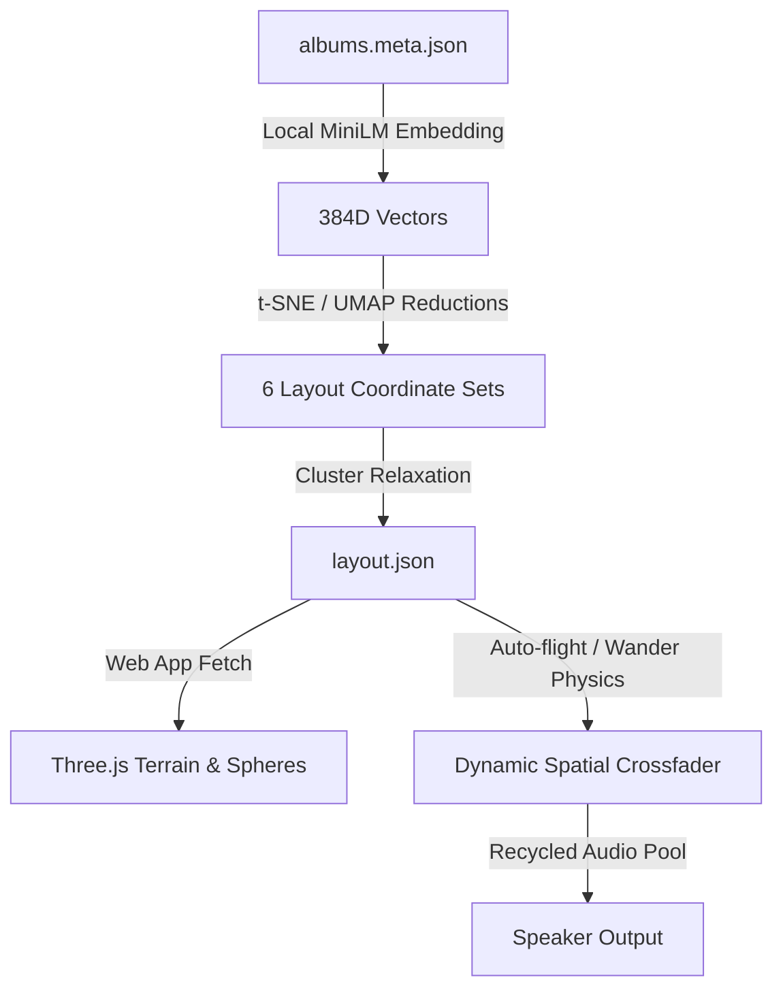

# 171exp — A Navigable Soundscape

An interactive, 3D navigable terrain grown from **171 days of Suno-generated music** (746 tracks). The experience maps semantic track features directly to 3D space, turning style-clusters into actual rolling hills and valleys. As the user or auto-flight nexus traverses the land, the system performs a real-time, spatial crossfade between nearby tracks—meaning that traveling through the landscape is literally performing a remix.

Visit the live project or mirror:
- Main Player: [glia.ca/2026/171days/](https://glia.ca/2026/171days/) (The audio player + archive repository)
- This Experience: [glia.ca/2026/171exp/](https://glia.ca/2026/171exp/) (~1 MB static build)

---

## Technical Architecture

The project is split into an **offline data processing pipeline** (Python/Node/Transformers) and a **real-time 3D/Audio client** (Three.js/Web Audio API).



### 1. The Offline Data Pipeline (`tools/`)

The data pipeline runs completely locally without external API dependencies:

- **Scraping Favorites (`scrape-favorites.mjs`)**: Scrapes published songs and "greatest hits" playlist data directly from suno.com. Titles are normalized and written to `public/data/favorites.json`.
- **Text Embedding (`build-layout.mjs`)**: Combines track titles, album names, and Suno style tags into a single text block per track. It generates 384-dimensional dense vectors using a local MiniLM model (`all-MiniLM-L6-v2` via `@xenova/transformers`).
- **Dimensionality Reduction**: Projects the 384-dimensional vectors down to 2D spatial layouts. To provide diverse structural layouts, it exports 6 different hyperparameter configurations:
  - **t-SNE**: Perplexities of `8`, `20`, and `45` (using `tsne-js`).
  - **UMAP**: Neighbors of `6`, `15`, and `40` (using `umap-js`).
- **Layout Relaxation**: Due to strict stylistic duplicates, some tracks overlap exactly. A local bucketed pair-repulsion algorithm (`relaxLayout` in `main.js`) diffuses overlapping coordinates on a grid to ensure each track remains visually distinct.

### 2. The 3D Rendering Engine (`src/world.js`)

The visual environment uses **Three.js** to construct an interactive, isometric-style workspace:
- **Kernel Density Terrain**: The 3D terrain height is computed dynamically using a Gaussian splat of track positions. High-density stylistic clusters form summits and ridges, while isolated tracks sit in flat valleys.
- **Dynamic Color Gradients**: The landscape is colored dynamically by vertex heights using a four-stop color scale:
  - *Valley (Night Water)*: `#0a1420`
  - *Lowland (Moss)*: `#1d3a33`
  - *Highland (Earth)*: `#8a7a55`
  - *Summit (Lit Peak)*: `#e8e0cc`
- **Instanced Spheres**: The 746 tracks are rendered via `THREE.InstancedMesh` for maximum rendering performance. Spheres are colored using a HSL color hash derived from their album title. Favorite/greatest-hits tracks glow with enhanced saturation and brightness.
- **Visual Playback Indicators**:
  - **The Nexus**: A slow-breathing gold ring and a vertical pillar of light marking the listener's focus.
  - **Orbital Playhead**: A thin golden ring orbiting the active track, with a glowing bead tracing the track's playback progress.

### 3. Spatial Web Audio Engine (`src/audio.js`)

To prevent browser crashes and huge network overhead, the audio player utilizes an optimized recycling pool:
- **Audio Element Recycling**: The engine recycles a small pool (maximum `6`) of HTML5 `Audio` elements connected to Web Audio API `MediaElementAudioSourceNode`s.
- **Equal-Power Crossfade**: The engine calculates the distance between the nexus and nearby tracks using an inverse-distance gain formula:
  $$\text{gain} = \frac{1}{1 + \left(\frac{d}{\text{falloff}}\right)^2}$$
  The nearest tracks (determined by the chaos factor) are selected and blended using an equal-power distribution (`sqrt(gain_share)`) so volume remains consistent across crossfades.
- **Real-time Amplitude Analysis**: An `AnalyserNode` captures frequency data for the playing tracks, causing the 3D spheres to pulse and bob in sync with the audio volume.

### 4. Cinematic Flight & Navigation (`src/drift.js`)

Navigation operates in two main modes:
- **Auto-Flight**: The nexus drifts gracefully from song to song. Next destinations are selected using a weighted random walk. Favorites act as beacons, yielding a **3.5× higher probability** of being visited when entering a region.
- **Wander (Manual)**: Disables the automatic pilot. The nexus is magnetized to follow your mouse cursor, allowing you to manually steer across the terrain and listen "between" style-clusters.
- **Cinematic Camera**: When idle, the camera moves on a slow orbit, gently tilting and dipping closer to the active track, then panning back out during cross-cluster travel. Any mouse drag/zoom gives control back to the user for 25 seconds.

---

## UI Parameters & Controls

The sidebar dashboard allows you to morph the landscape and behavior in real-time:

- **Topology (t-SNE → UMAP)**: Linearly morphs the coordinate systems between the 6 precomputed layouts. You can watch the clusters tear apart and reform as you slide.
- **Spread**: Blends between raw projections (dense clusters) and relaxed coordinates (dispersed, clickable nodes).
- **Listening Region**: Adjusts the falloff radius (the physical size of the listening circle). Smaller values require you to be directly on top of a sphere to hear it; larger values create sprawling ambient mixes.
- **Chaos**: Modulates multiple parameters at once:
  - Increases the number of simultaneous active voices (from `1` to `4`).
  - Scales random seek offsets (starting tracks in the middle instead of the intro).
  - Increases the "temperature" of auto-flight navigation, causing the nexus to take wider, less predictable paths.

---

## Installation & Commands

### Prerequisites
Make sure you have [Node.js](https://nodejs.org/) installed.

```bash
# Install package dependencies
npm install
```

### Data Pipeline Scripts
If you want to re-run the layout or scrape updated favorites:

```bash
# 1. Scrape favorite/greatest hits track metadata from Suno.com
npm run data:favorites

# 2. Re-embed and re-compute t-SNE & UMAP coordinates (requires local model download)
npm run data:layout
```

### Building & Running

To build the static application assets:

```bash
# Bundles client scripts with esbuild and copies assets to dist/
npm run build
```

To run the local stage server:
```bash
# Starts a server at http://localhost:3210/ with support for range requests (audio seeks)
npm run stage
```
*Note: The local staging server expects to serve files out of a sibling folder `../2026-site/public/audio/`. You can override this behavior by appending `?audio=https://raw.githubusercontent.com/jhave/audio-hub/main/2026-site/public/audio` to the URL.*

---

## Deployment & Adjacency

The static experience is lightweight (~1 MB) because it fetches audio files on-demand. To deploy:
1. Compile the build: `npm run build`.
2. Deploy the `dist/` folder contents next to the player folder (e.g., `glia.ca/2026/171exp/` and `glia.ca/2026/171days/` as siblings).
3. If deployed elsewhere, load the application with the query parameter `?audio=<custom_base_url>` to point it to your audio server/mirror.
