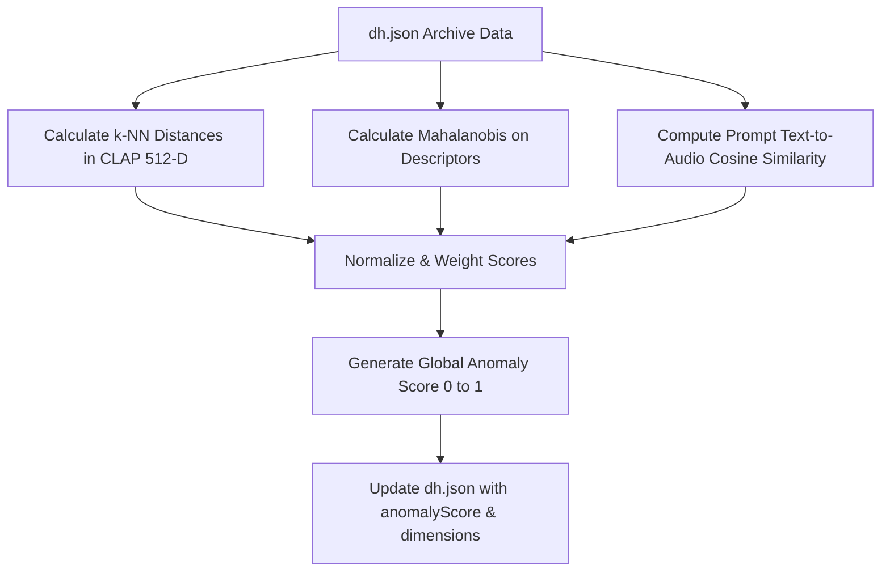

# Implementation Plan: Sonic Anomaly & Outlier Mapping

This document outlines a technical plan to detect, calculate, and visualize anomalies and outliers across the 171-day generative music archive of 746 tracks. By combining dense semantic embeddings (CLAP) and extracted physical descriptors (Librosa, Suno metadata), we can map the "outer bounds" of the generative parameter space.

---

## 1. Defining "Anomalies" in Generative Space

We classify outliers into three distinct mathematical dimensions:

### Dimension A: Acoustic Isolation (CLAP Embedding Outliers)
* **Concept**: Tracks that sound unlike anything else in the library (unique timbres, structures, or noise profiles).
* **Math**: 
  * Calculate each track's average distance to its $k$-nearest neighbors ($k=5$) in the 512-dimensional CLAP space.
  * Run **Local Outlier Factor (LOF)** or an **Isolation Forest** on the centered CLAP matrix.
  * High-LOF tracks represent acoustic islands isolated from the main clusters.

### Dimension B: Descriptor Extremes (Multivariate Descriptors)
* **Concept**: Tracks that exhibit extreme, chaotic, or unstable combinations of traditional audio metrics (e.g., extreme tempo jumps combined with high melodic complexity and zero rhythmic bounce).
* **Math**:
  * Normalize continuous descriptors (weirdness, style weight, tempo drift, tempo jumps, bounce, melodic complexity, journey, spread) to Z-scores.
  * Calculate the **Mahalanobis Distance** of each track from the global descriptor centroid. This accounts for correlations between variables (e.g., high tempo is normally correlated with high onset rate, so a track with high tempo but near-zero onset rate is a covariance outlier).

### Dimension C: Prompt Drift (Intention vs. Output)
* **Concept**: Generative "glitches" or deviations where the synthesized audio completely ignores the style tags in the prompt.
* **Math**:
  * Pass the ground-truth Suno prompt string through the CLAP text encoder.
  * Calculate the cosine similarity between the prompt text embedding and the track's final audio embedding.
  * Tracks with the **lowest similarity scores** represent prompt drift anomalies (where the model "hallucinated" a style completely unrelated to the text input).

---

## 2. Technical Execution Pipeline

### Step 1: Feature Centering & Distance Matrices
We write a python script `tools/deep_step7_anomalies.py` that loads:
- `ALL_track_embeddings.json` (512-D vectors)
- `descriptors.json` (Librosa and Suno truth features)
It centers the data and runs scikit-learn's `LocalOutlierFactor` and `IsolationForest`.

### Step 2: Compute Composite Anomaly Scores
For each track $t$, we compute a normalized score $A(t) \in [0, 1]$:
$$A(t) = w_1 \cdot \text{LOF}(t) + w_2 \cdot \text{Mahalanobis}(t) + w_3 \cdot (1.0 - \text{PromptSimilarity}(t))$$
Where weights default to $w_1 = 0.5$, $w_2 = 0.3$, $w_3 = 0.2$.

### Step 3: Bundle into Database
Add `"anomalyScore": float` to `DHTrack` in the bundled `dh.json`.

---

## 3. UI Visualization: The Anomaly Map

Once the scores are integrated into the database, we can update the experience web interface:

### UI Feature 1: Anomaly Map Heatmap Mode
* **Toggle**: Add an "Aesthetic Mode" toggle to the map: `Default (Album Colors) | Outliers (Heatmap)`.
* **Visuals**: In Outlier mode, coordinates are unchanged (preserving semantic UMAP neighborhood), but the points are colored using a gradient:
  * **Low Anomaly (Standard)**: Translucent muted gray (`rgba(115,115,115,0.3)`)
  * **Mid Anomaly**: Orange
  * **High Anomaly (Outliers)**: Glowing magenta/red (`rgb(226, 75, 74)`) with an active radial pulse animation on hover.

### UI Feature 2: Play Order Mode
* **Toggle**: Add `"outliers"` to the `OrderMode` dock selections.
* **Behavior**: Sorts the play queue descending by `anomalyScore` so the user can play the archive starting from the most bizarre, atypical sonic aberrations down to the most standard, cliched structures.

### UI Feature 3: FAQ Entry
* Detailed description of the anomaly detection methodology, explaining how multivariate outliers differ from simple "Section Shifts" (the renamed Novelty count).
